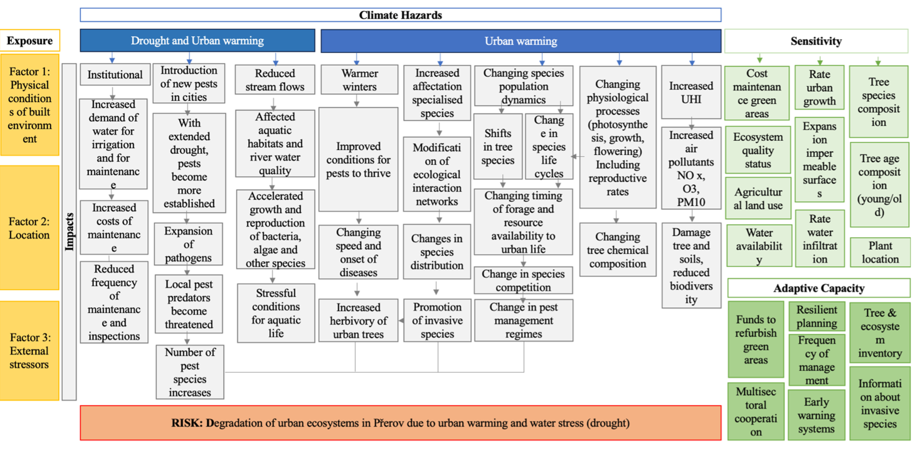
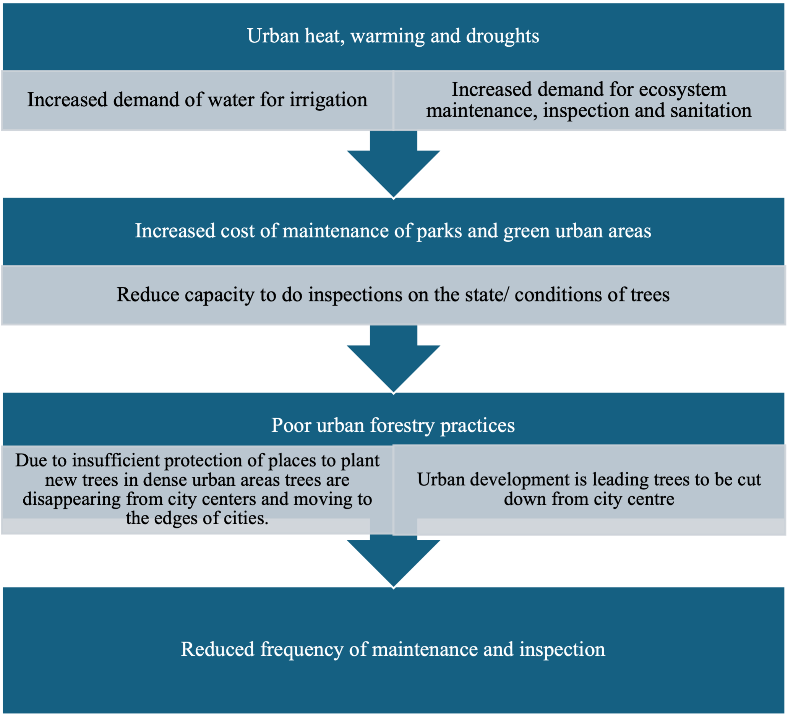
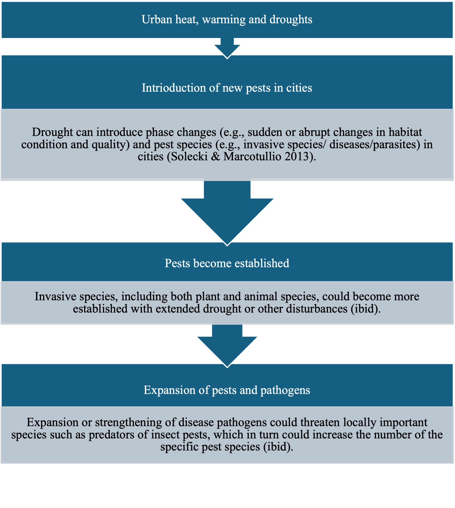
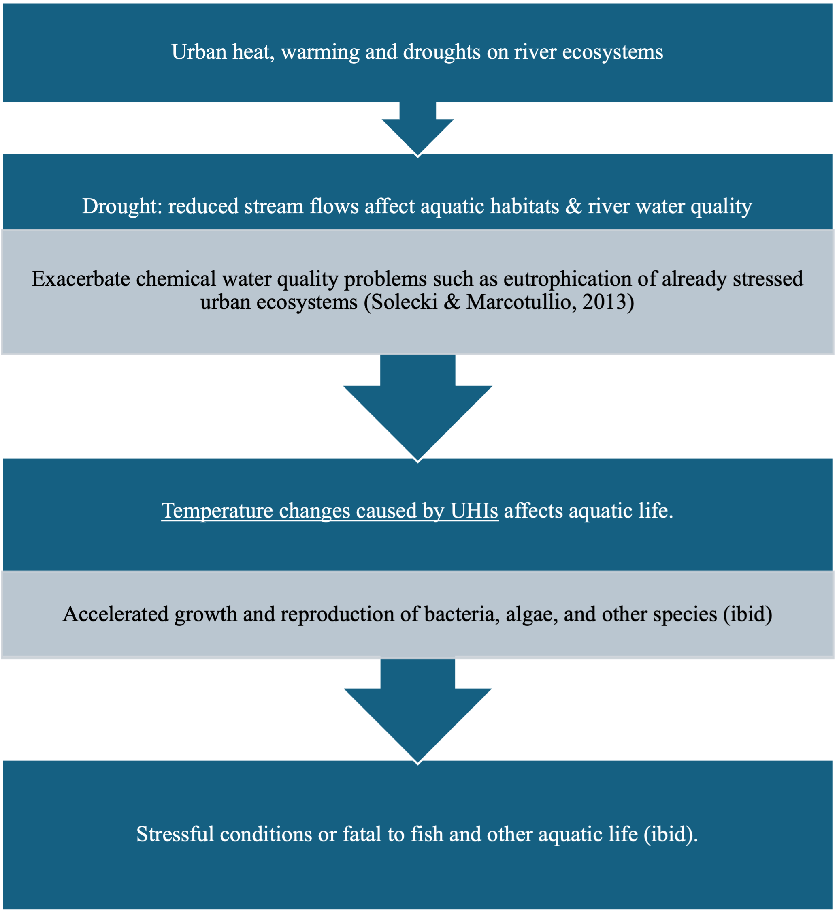
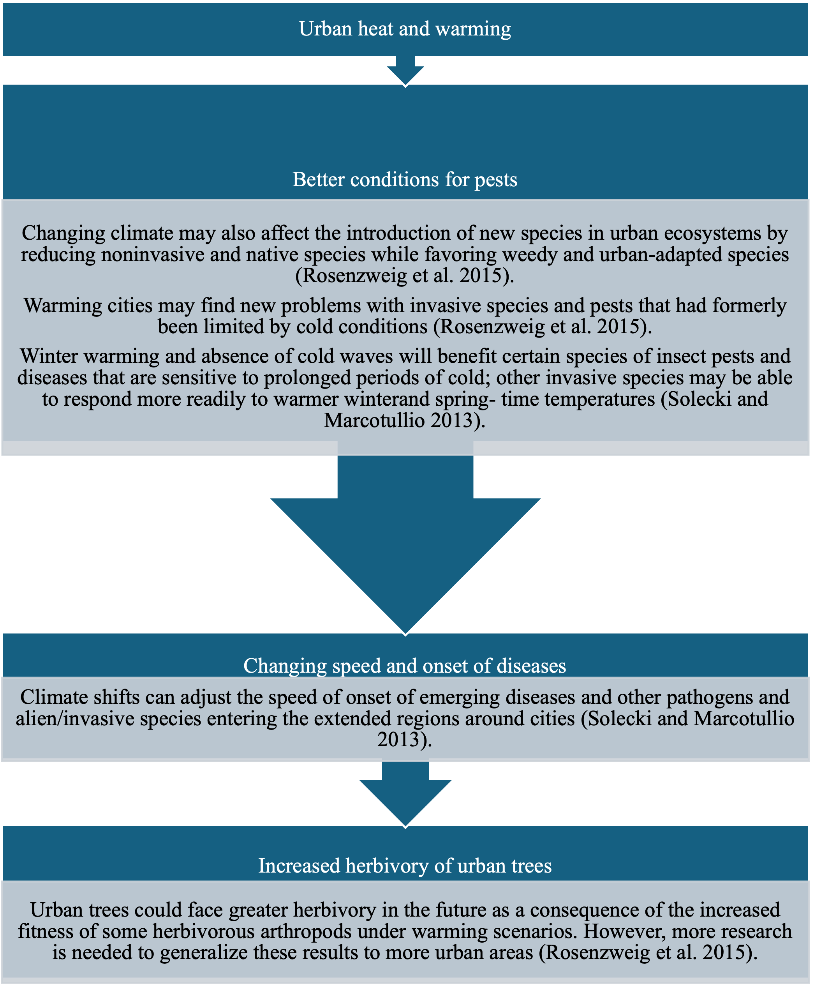
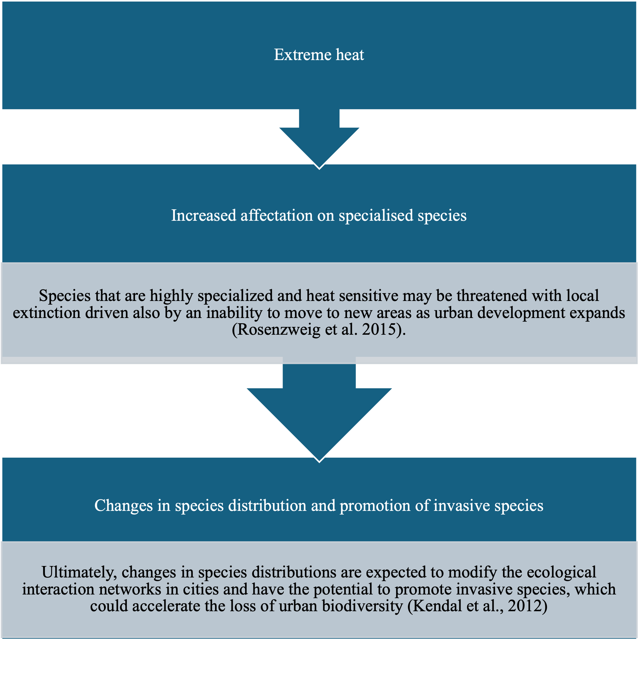
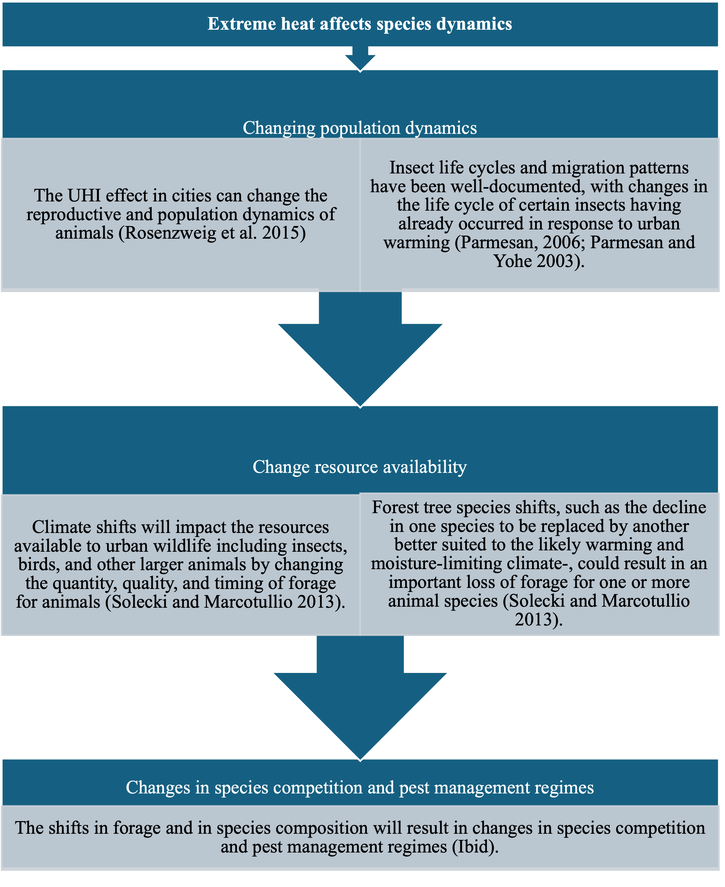
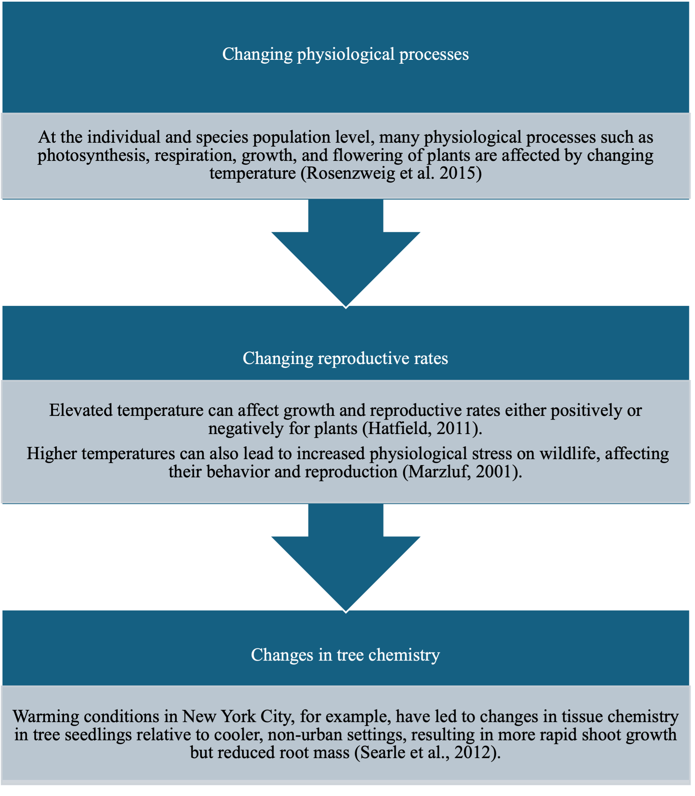
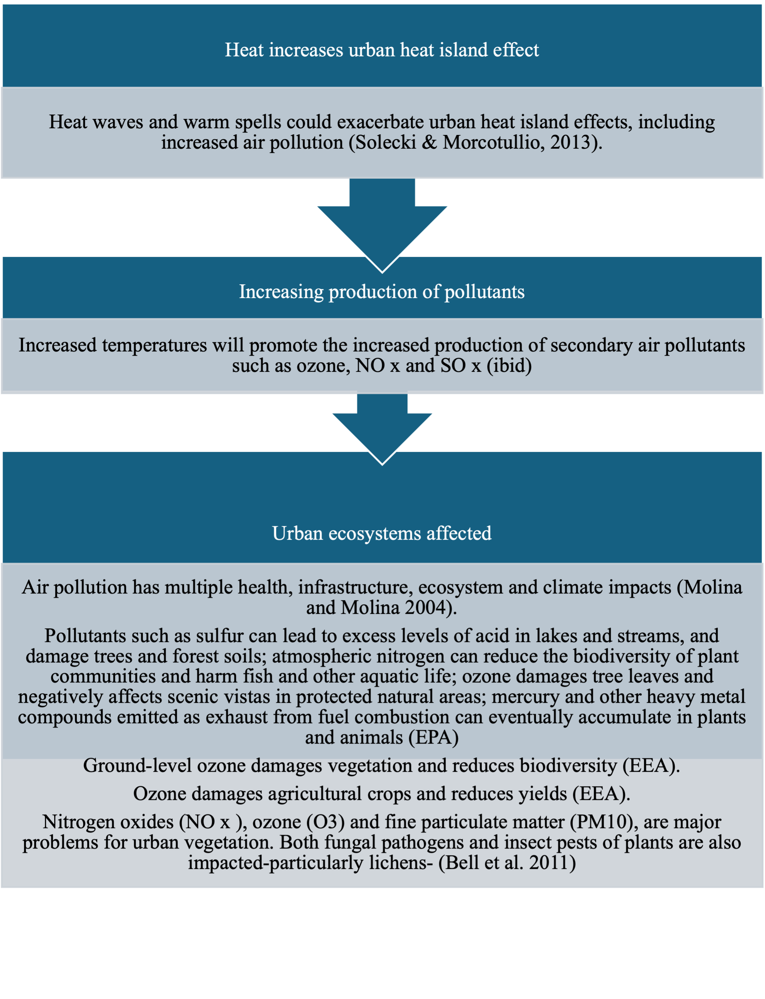

# CIC 1 – Urban Ecosystems Degradation (Heat & Drought)

**Main Risk:** Degradation of urban ecosystems due to urban heat and droughts.

## Key Policy Issues
* Urban heat island effect and drought degrading urban green spaces.
* Loss of ecosystem services (temperature control, recreation areas).
* Introduction of foreign pests and shifts in plant–disease patterns.
* Stress on aquatic life and species distribution changes.
* Need for resilient urban planning, green infrastructure, ecosystem monitoring.
* Address social vulnerability (elderly, health‑compromised groups).

## Sequences
### 1. Institutional impacts
Reduced maintenance & inspection capacity accelerates degradation.

### 2. Expansion of pests and pathogens
Heat & drought enable spread and persistence.

### 3. Drought & heat on river ecosystems
Aquatic habitat degradation under compounded stress.

### 4. Heat on pests & tree degradation
Tree health declines; new pest assemblages emerge.

### 5. Promotion of invasive species
Specialised species decline; invasive species fill niches.

### 6. Population dynamics & forage availability
Extreme heat alters growth, reproduction, food webs.

### 7. Plant physiology
Stress in photosynthesis, respiration, water regulation reduces resilience.

### 8. Heat & air pollution
Higher temperatures exacerbate pollutant formation impacting vegetation.

Return to [Overview](index.md).
