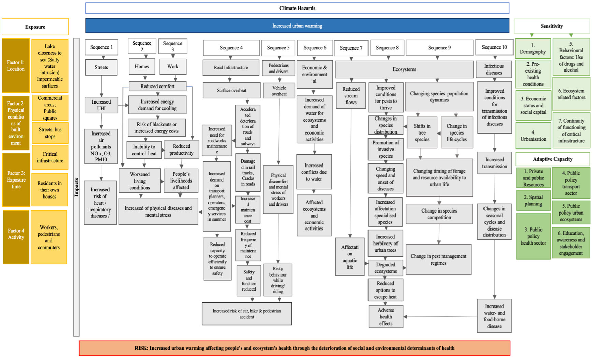
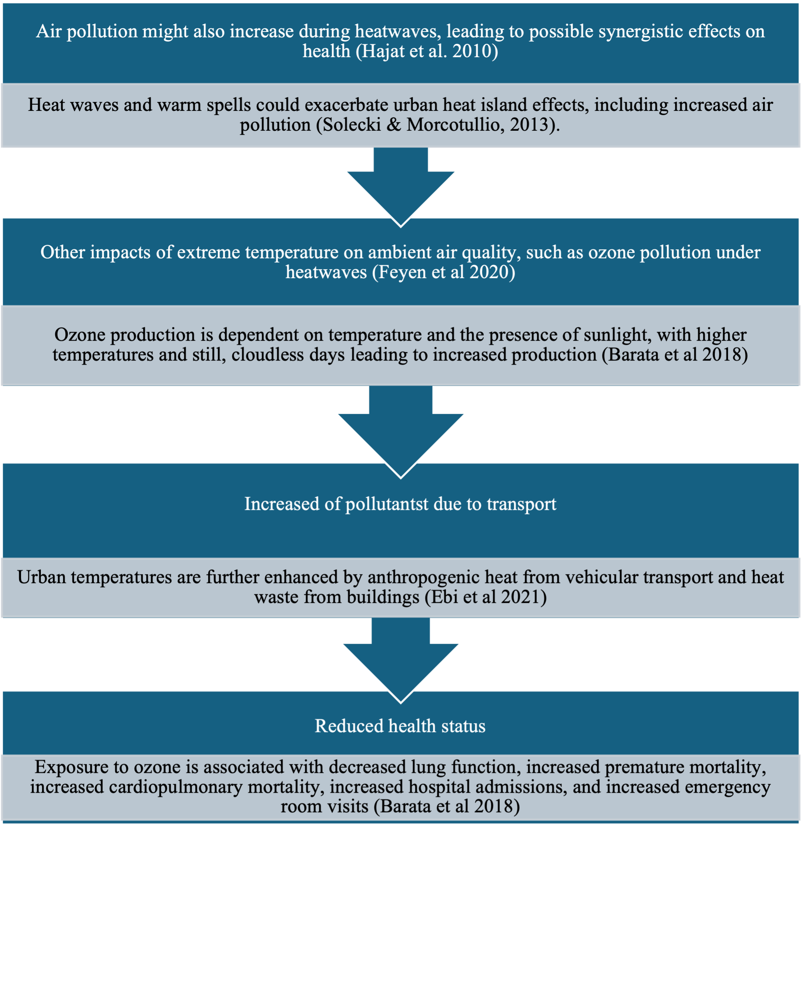
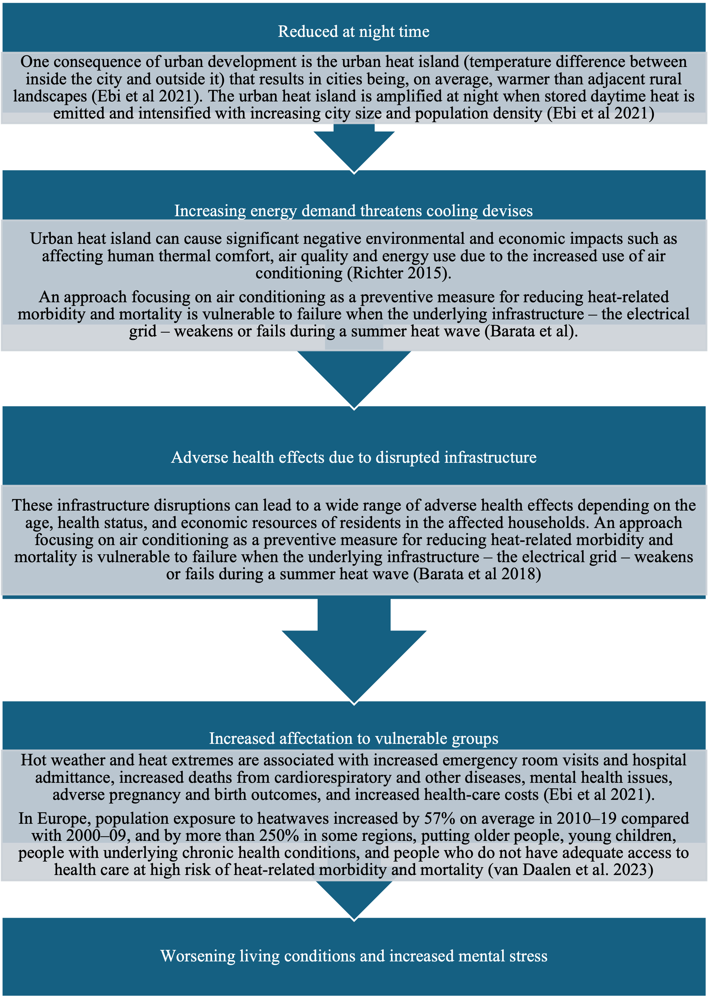
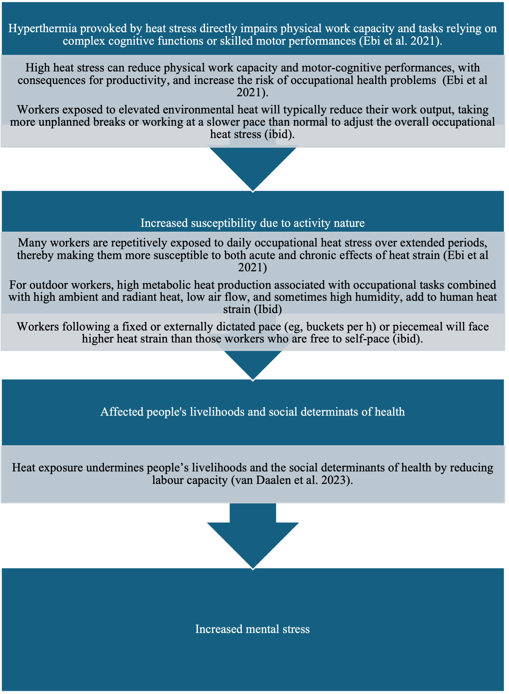
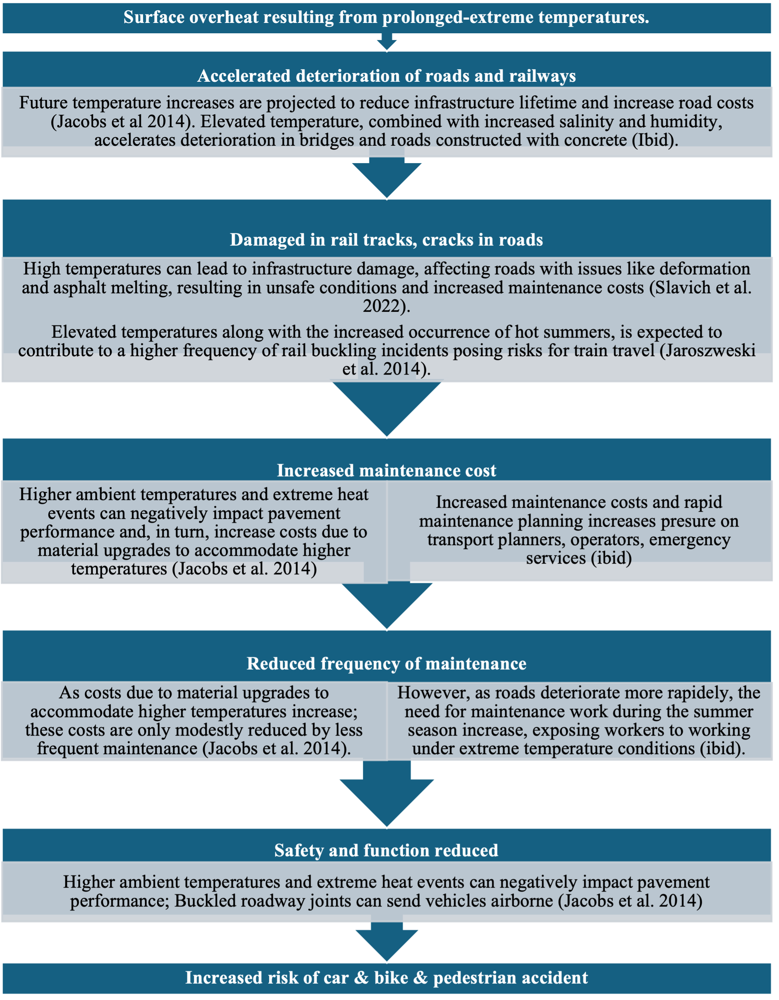
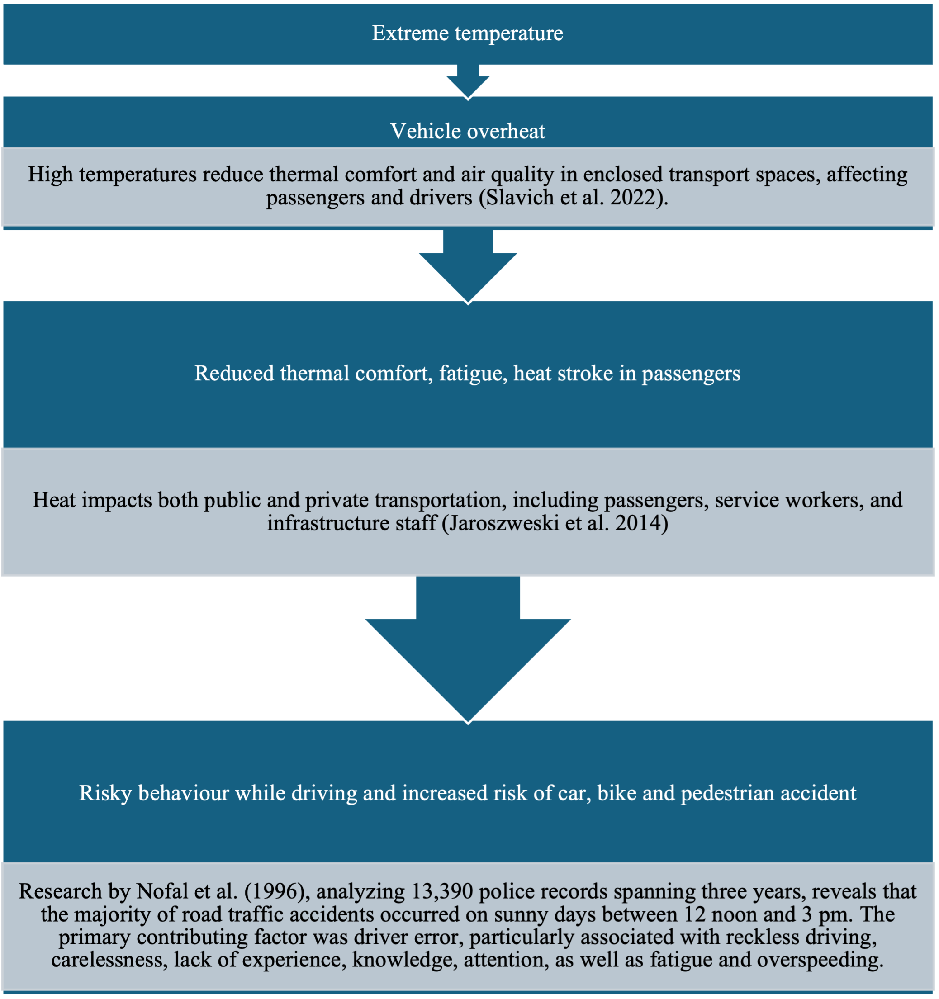
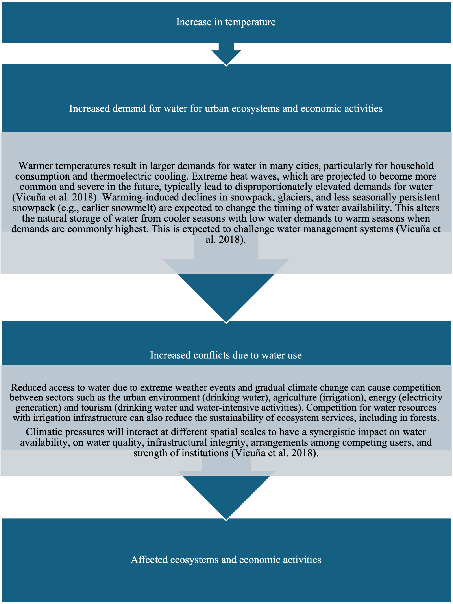
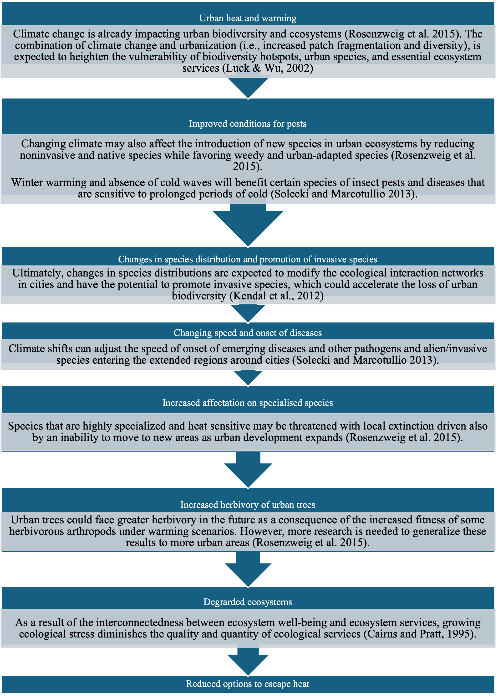
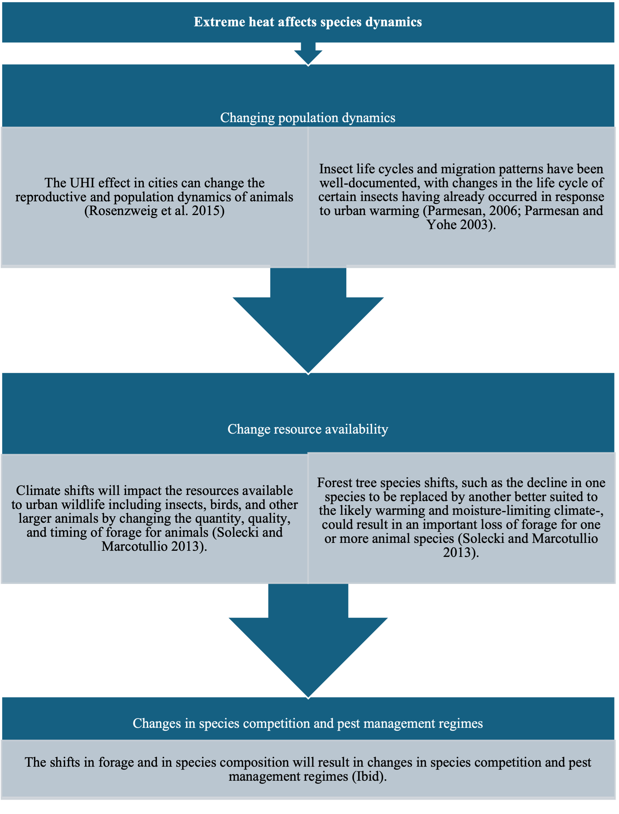
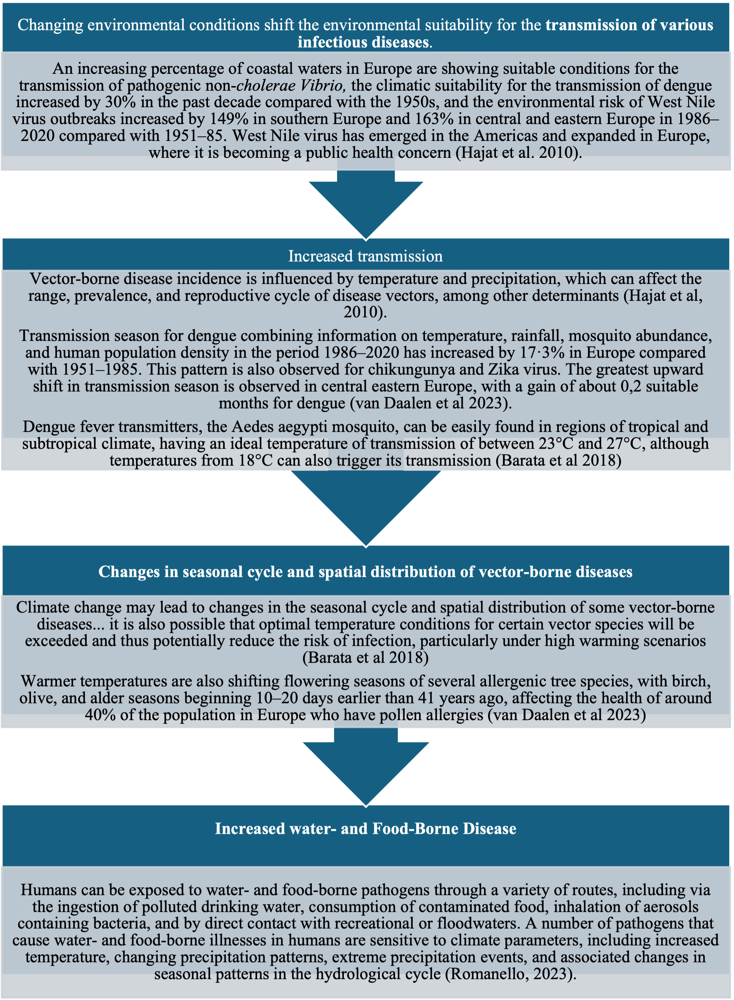

# CIC 2 – Heat & Health in Mobility Systems

**Main Risk:** Heat affecting people’s health in urban transport contexts and degrading social & environmental determinants of health.

## Key Policy Issues
* Heat stress & accidents (public transport, cycling, walking).
* Overheating infrastructure (roads, vehicles).
* Vulnerable groups (elderly, children, pre-existing conditions).
* Need for early warning & public health interventions.
* Resilient transport & cooling spaces.

## Sequences
### 1. Heat → air pollution → health effects

### 2. Household exposure & indoor heat

### 3. Reduced productivity & occupational health

### 4. Mobility accidents & infrastructure stress

### 5. Mobility risks (behavioural & physiological)

### 6. Reduced water availability → ecosystems & economy

### 7. River ecosystem degradation

### 8. Loss of cooling ecosystem services

### 9. Population dynamics & forage availability

### 10. Increased water- & food-borne disease

Return to [Overview](index.md).
