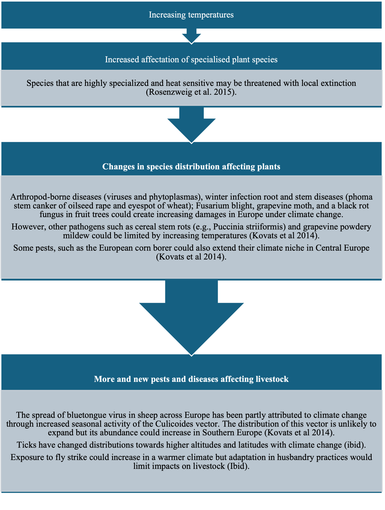
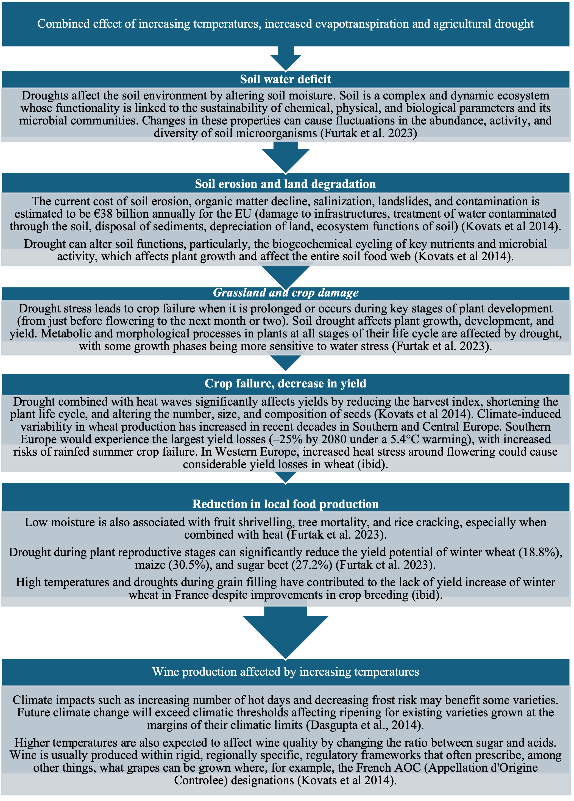
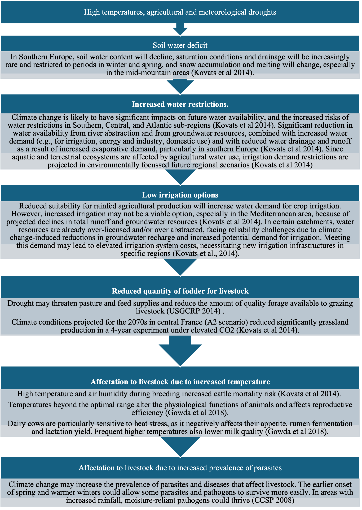
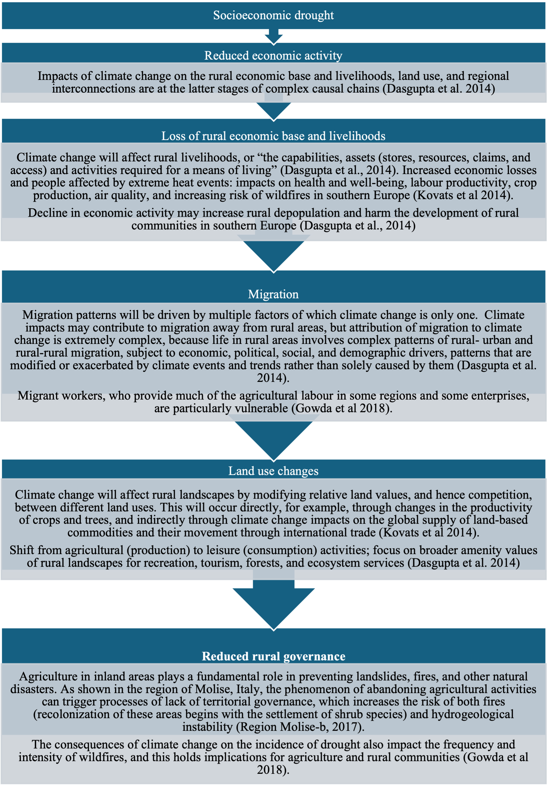
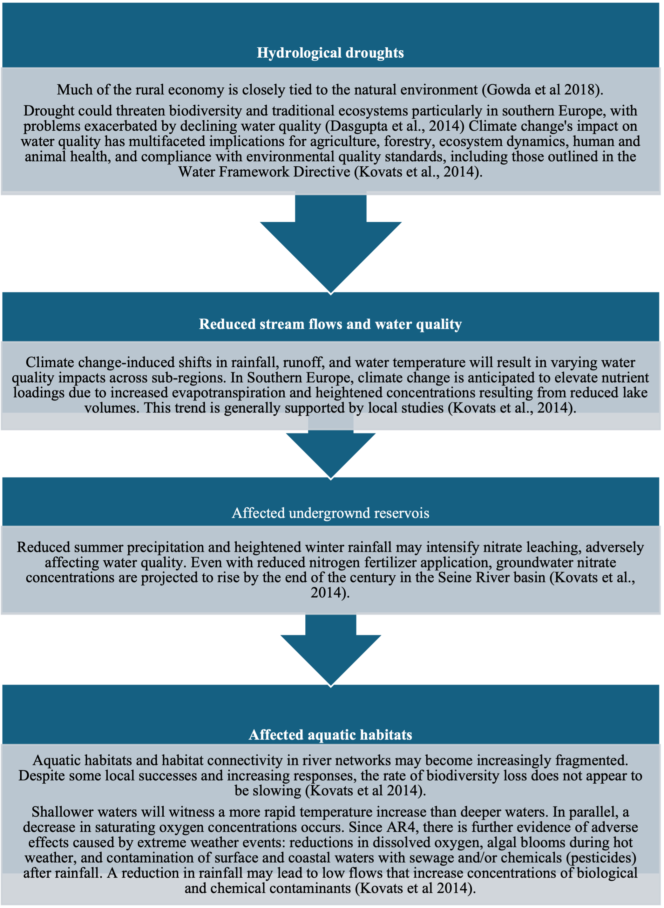

# CIC 3 – Drought & Agricultural Livelihoods

**Main Risk:** Drought affecting agricultural production and rural livelihoods.

## Key Policy Issues
* Water scarcity & competing uses.
* Soil erosion, salinisation & land degradation.
* Declining productivity & livelihood vulnerability.
* Need for sustainable water management & ecosystem restoration.

## Sequences
### 1. Heat & specialised species → pests & diseases

### 2. High temperature + evapotranspiration → agricultural drought & soil erosion

### 3. Drought types → water restriction & fodder shortage

### 4. Rural livelihood impacts

### 5. Hydrological drought → aquatic ecosystem imbalance

Return to [Overview](index.md).