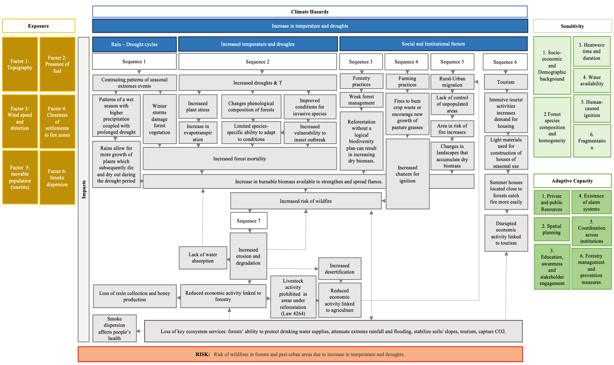
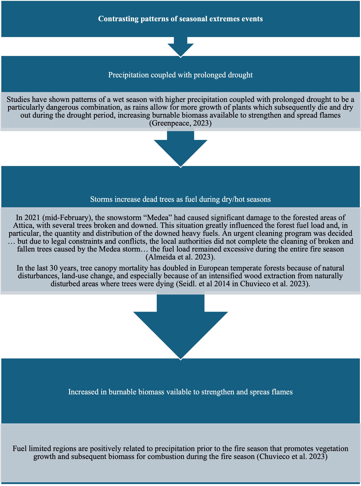
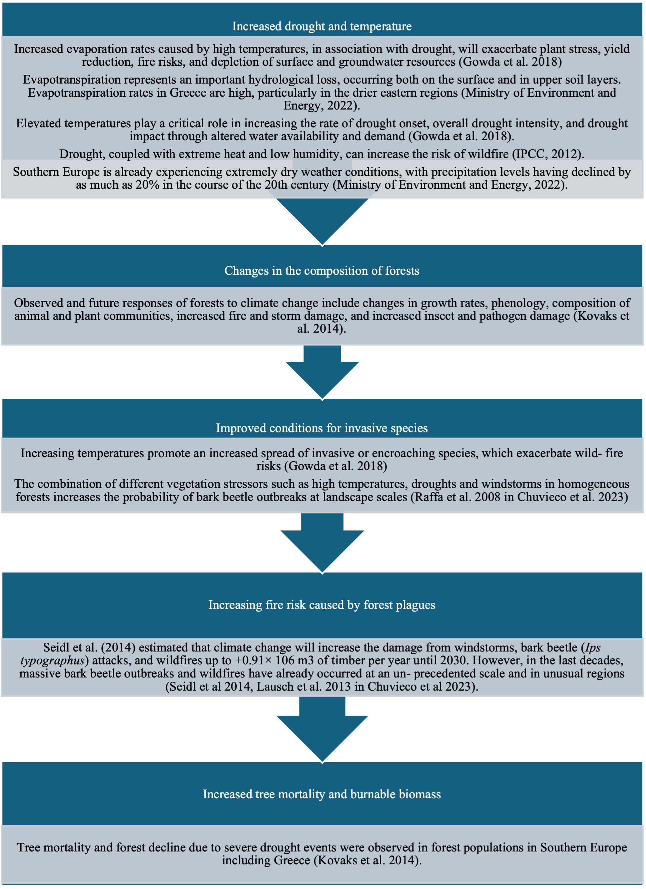
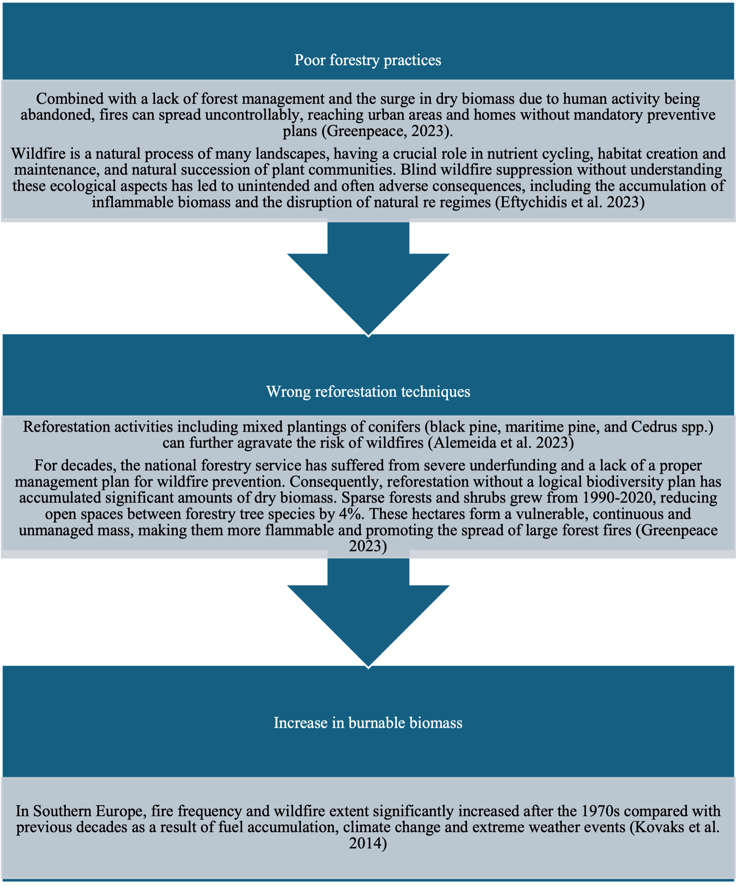
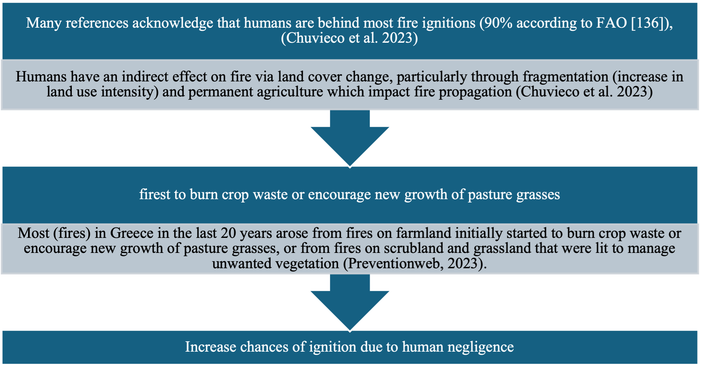
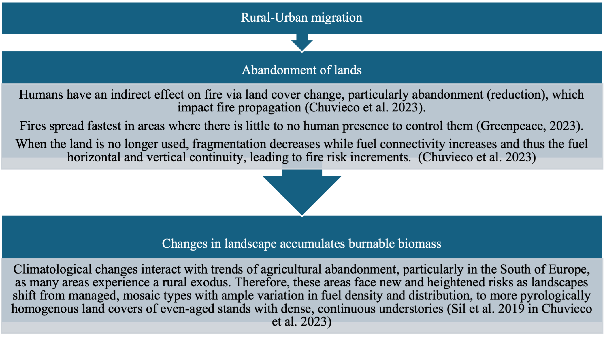
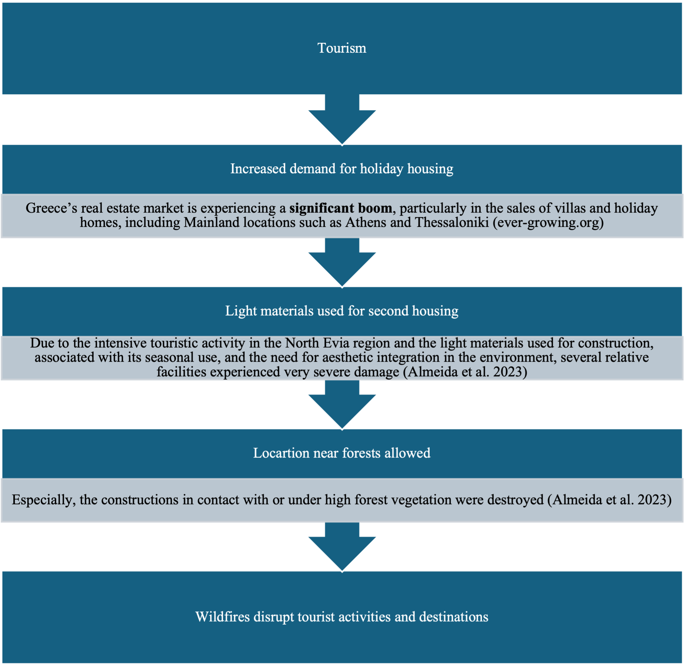
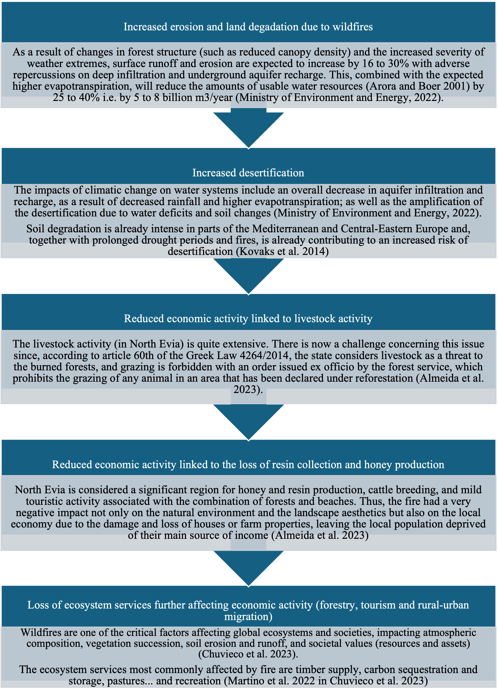

# CIC 4 – Wildfire Risk Escalation

**Main Risk:** Drought and heat increasing the risk of wildfire.

## Key Policy Issues
* Elevated wildfire risk (heat, drought, poor forest management).
* Fuel load from storms & lack of maintenance.
* Tourism pressure increasing ignition & exposure.
* Need for integrated forest & wildfire management.

## Sequences
### 1. Seasonal extremes → fuel generation

### 2. Increased drought & temperature

### 3. Forestry practices & biomass accumulation

### 4. Farming practices & ignition risk

### 5. Rural–urban migration & land abandonment

### 6. Tourism & propagation risk

### 7. Socio-economic & ecological impacts

Return to [Overview](index.md).
