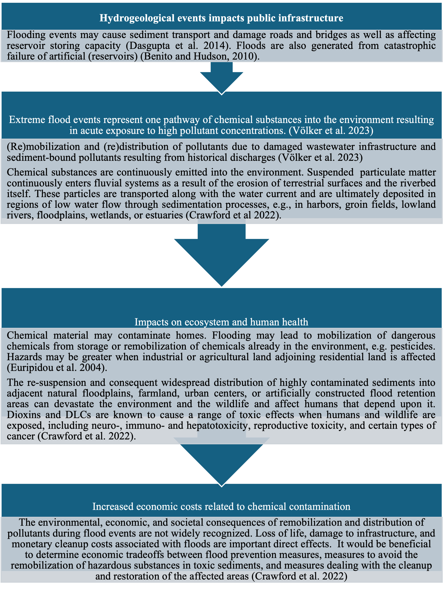
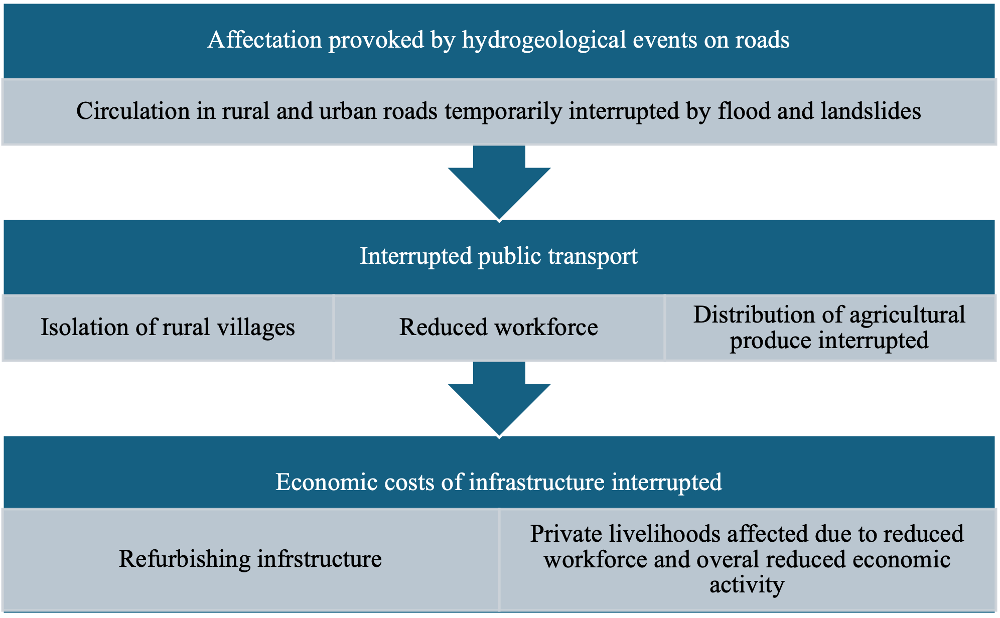
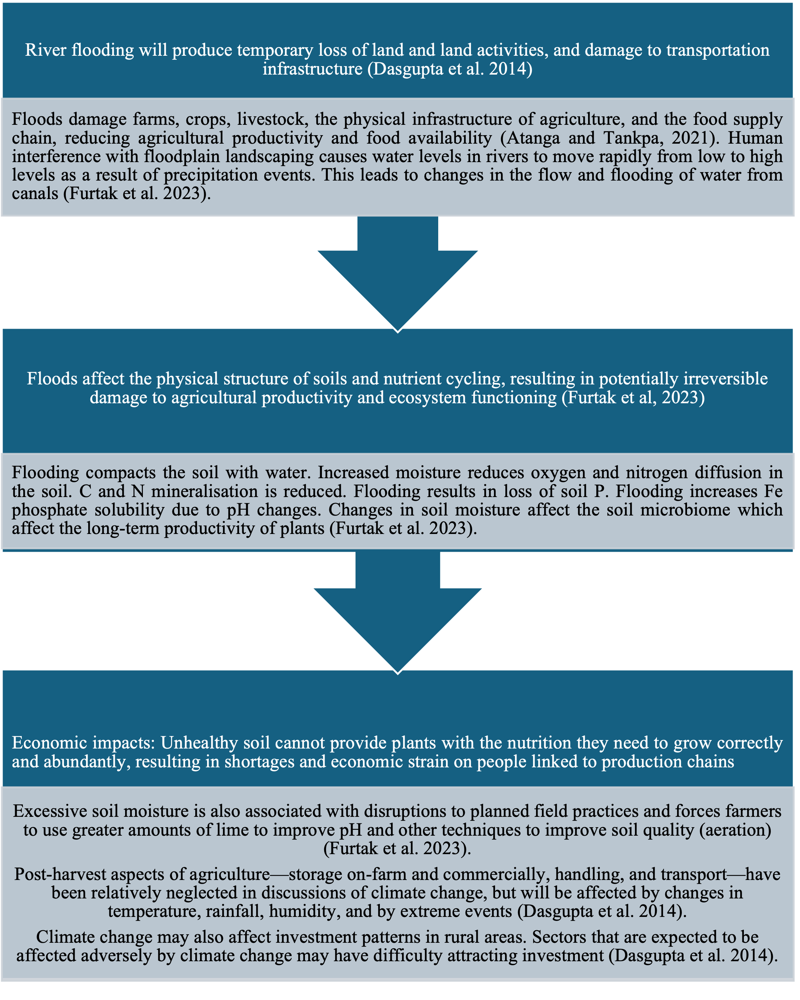
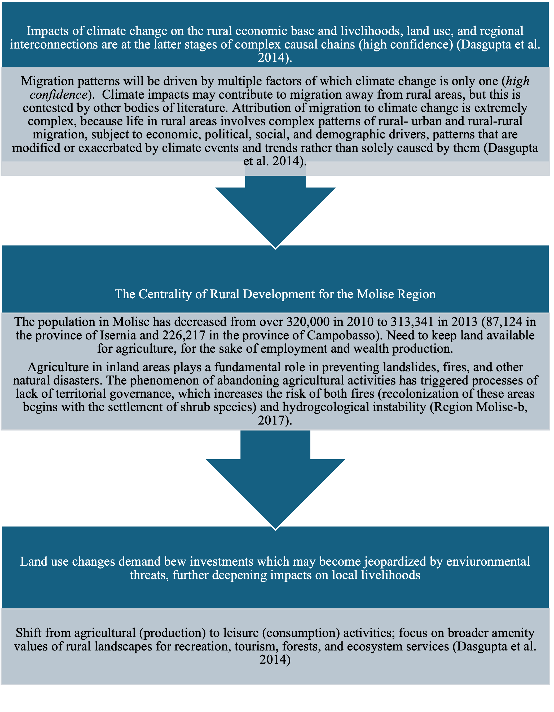

# CIC 5 – Floods & Rural Livelihoods

**Main Risk:** Floods affecting rural livelihoods.

## Key Policy Issues
* Flooding of agricultural land & rural infrastructure.
* Risk of dam failure & chemical contamination.
* Outmigration & governance erosion increasing multi-hazard risks.
* Need for robust flood management & rural development policies.

## Sequences
### 1. Hydrogeological events → chemical pollutant dissemination

### 2. Interruption of public services (transport networks)

### 3. Soil degradation & reduced productivity

### 4. Demographic trends & land use change

Return to [Overview](index.md).